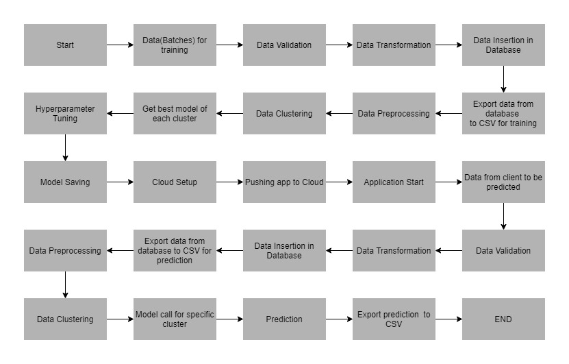
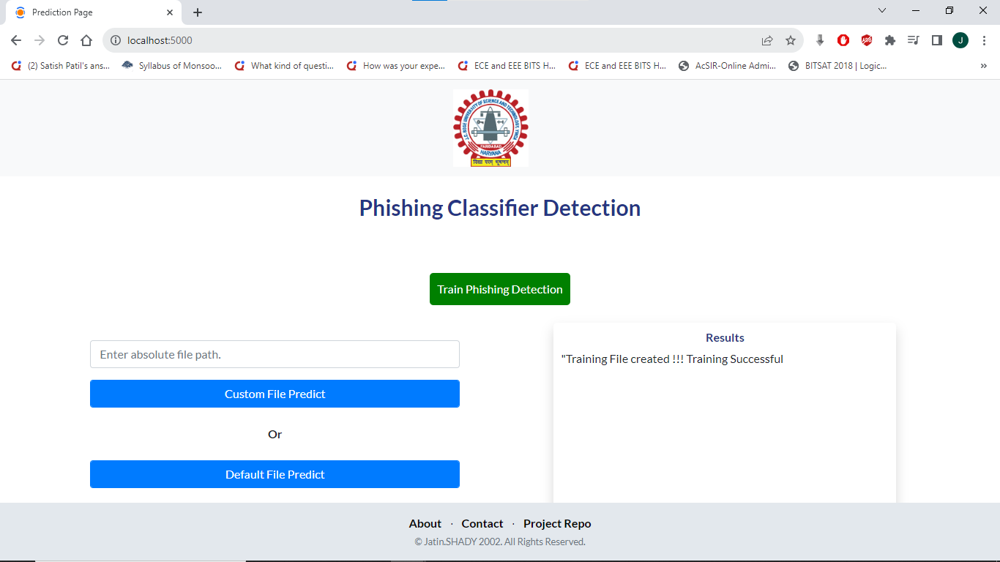
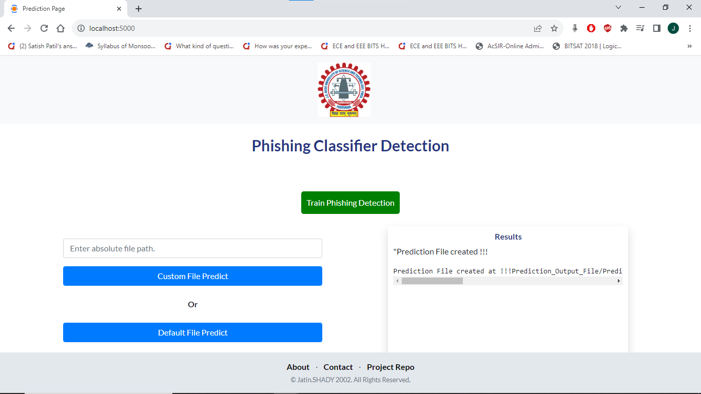
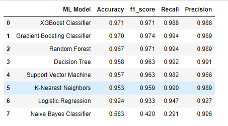
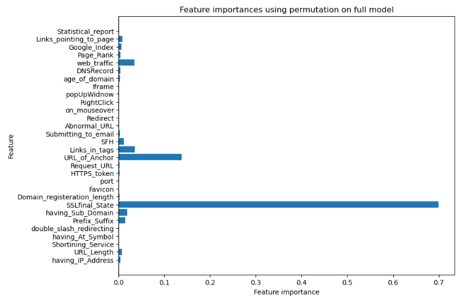

# Phishing-Classifier

# Introduction

The Internet has become an indispensable part of our life, However, It also has provided opportunities to anonymously perform malicious activities like Phishing. Phishers try to deceive their victims by social engineering or creating mockup websites to steal information such as account ID, username, password from individuals and organizations. Although many methods have been proposed to detect phishing websites, Phishers have evolved their methods to escape from these detection methods. One of the most successful methods for detecting these malicious activities is Machine Learning. This is because most Phishing attacks have some common characteristics which can be identified by machine learning methods.

## Tech Stack Used
1. Python 
2. Flask
3. Machine learning algorithms
4. Pandas
5. Scikit-Learn

# Installation

The Code is written in Python 3.7.6. If you don't have Python installed you can find it here. If you are using a lower version of Python you can upgrade using the pip package, ensuring you have the latest version of pip. To install the required packages and libraries, run this command in the project directory after cloning the repository:


## Project Archietecture



## Training Successful Screenshots


## Prediction Successful Screenshots



### Step 1: Clone the repository
```bash
git clone https://github.com/jatin-12-2002/phishing-classifier.git
```

### Step 2- Create a conda environment after opening the repository

```bash
conda create -p env567 python=3.7.6 -y
```

```bash
conda activate env567/
```

### Step 3 - Install the requirements
```bash
pip install -r requirements.txt
```

### Step 4 - Run the application server
```bash
python main.py
```

### Step 5. Train application
```bash
http://localhost:5000/train

```

### Step 6. Prediction application
```bash
http://localhost:5000/predict

```

## Result

Accuracy of various model used for URL detection



Feature importance for Phishing URL Detection



## Conclusion

1. The final take away form this project is to explore various machine learning models, perform Exploratory Data Analysis on phishing dataset and understanding their features.
2. Creating this notebook helped me to learn a lot about the features affecting the models to detect whether URL is safe or not, also I came to know how to tuned model and how they affect the model performance.
3. The final conclusion on the Phishing dataset is that the some feature like "SSLfinal_State", "URL_of_Anchor", "web_traffic" have more importance to classify URL is phishing URL or not.
4. XGBoost Classifier currectly classify URL upto 97.1% respective classes and hence reduces the chance of malicious attachments.


